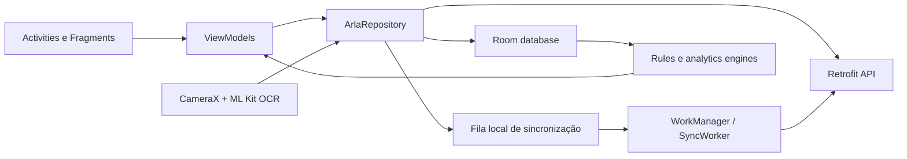

# FrotaMind

Aplicação Android nativa em Java para transformar abastecimentos, odômetros e eventos de segurança em controle operacional, indicadores financeiros e alertas de frota.

## Problema

Operações de frota precisam registrar evidências em campo, continuar funcionando com conectividade instável e consolidar dados de abastecimento e segurança em informações úteis para motoristas e gestores.

## Solução

O FrotaMind combina persistência local, regras de domínio e sincronização em segundo plano. O aplicativo registra abastecimentos de ARLA e diesel, calcula indicadores, acompanha aferições de odômetro, importa eventos operacionais de segurança e apresenta dashboards por perfil de acesso.

## Arquitetura atual



O repositório coordena a fonte local e a API remota. Registros pendentes permanecem na fila de sincronização e o `SyncWorker` tenta enviá-los posteriormente, preservando o fluxo offline.

## Stack implementada

- Java 17
- Android SDK 34, minSdk 26
- AndroidX, Material Components e View Binding
- Room para persistência local
- Retrofit, OkHttp e Gson para integração HTTP
- WorkManager para sincronização em segundo plano
- CameraX e ML Kit Text Recognition para captura e extração
- JUnit 4 para testes locais

## Capacidades de domínio

### Abastecimento e evidências

- registros de ARLA e diesel
- captura e associação de evidências
- extração de informações de imagens e recibos
- checklist e validação antes da persistência
- estado de sincronização por registro

### Regras e indicadores

- cálculo de valor total e custo por quilômetro
- validações de preço, volume e odômetro
- faixas esperadas de abastecimento e consumo por veículo
- indicadores operacionais integrados de abastecimento e segurança
- comparativos financeiros por período
- priorização de alertas e rankings

### Operação e segurança

- cadastro e consulta de veículos e motoristas
- aferição periódica de odômetro e controle de prazos
- importação de planilhas de eventos de segurança
- dashboards e filtros operacionais
- permissões de ações sensíveis por papel de usuário
- geração de dados para relatórios

## Estrutura principal

```text
app/src/main/java/com/example/arlacontrole/
├── analytics/   # indicadores operacionais, financeiros e de segurança
├── data/        # Room, Retrofit e repositório
├── evidence/    # gestão de arquivos de evidência
├── importer/    # importação de eventos
├── model/       # modelos da aplicação
├── rules/       # regras de abastecimento, custo e odômetro
├── sync/        # WorkManager e fila de sincronização
├── ui/          # activities, fragments e view models
└── vision/      # OCR, parsers e validação de extração
```

## Autenticação

O fluxo normal solicita e-mail e senha e envia `POST /auth/login` pela API configurada. Uma sessão válida direciona o usuário à tela principal; sem sessão, o aplicativo retorna ao login. Não há fluxo de acesso rápido nem credenciais compartilhadas embutidas na interface.

## Como executar

1. Instale Android Studio com JDK 17 e Android SDK 34.
2. Abra o projeto e aguarde a sincronização do Gradle.
3. Configure a URL da API nas preferências do aplicativo.
4. Execute em emulador ou dispositivo Android 8.0+.

Pelo terminal no Windows:

```powershell
.\gradlew.bat :app:assembleDebug
```

## Testes

A suíte local cobre regras de combustível e custo, filtros, parsers de OCR, checklist, importação de segurança, relatórios, permissões e engines de indicadores.

```powershell
.\gradlew.bat :app:testDebugUnitTest
```

### Estado da validação

Em 20 de agosto de 2026, `:app:testDebugUnitTest` e `:app:assembleDebug` foram executados em conjunto com Gradle 8.11.1, JDK 21 e Android SDK local: **BUILD SUCCESSFUL**, com 41 tarefas concluídas. O build emitiu avisos sobre APIs e recursos Gradle depreciados, que permanecem como dívida técnica, mas não impediram testes, compilação ou geração do APK debug.

## Decisões técnicas

- **Offline-first:** Room é a fonte local para que o registro de campo não dependa de conectividade contínua.
- **Sincronização adiada:** WorkManager processa pendências sem bloquear a interface.
- **Regras isoladas:** cálculos e classificações ficam em engines testáveis, separados das telas.
- **Evidência local:** imagens são associadas aos registros e compartilhadas por `FileProvider`.
- **Autorização explícita:** ações administrativas usam o papel retornado pela sessão, sem atalhos de credenciais.

## Segurança

Credenciais não devem ser versionadas. O aplicativo ainda permite HTTP para desenvolvimento local e armazena o access token em `SharedPreferences`; antes de uso real, a comunicação deve exigir HTTPS e a sessão deve migrar para armazenamento criptografado.

## Limitações atuais

- depende de um backend compatível para autenticação e sincronização
- há avisos de APIs e recursos Gradle depreciados a tratar antes da migração para Gradle 9
- HTTP em desenvolvimento e armazenamento de token ainda precisam ser endurecidos
- políticas de retenção e proteção das evidências locais precisam ser definidas para produção

## Autor

Renato Boranga
